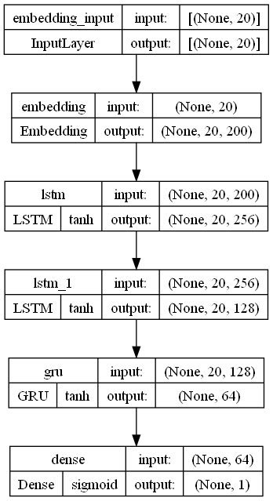
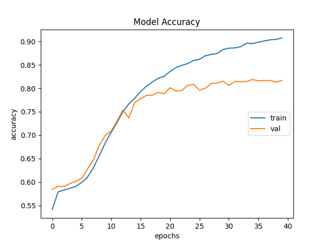
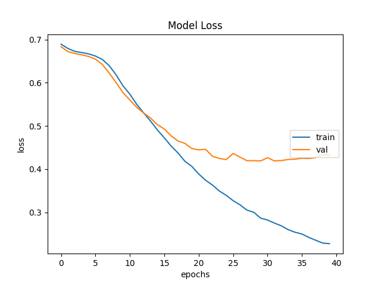

# SarcastoScope

Detecting sarcasm in news headlines using Natural Language Processing and Deep Learning.

## Introduction

Sarcasm is a form of verbal irony that is intended to express contempt or ridicule. It is often recognized through cues such as tone of voice or facial expression. However, in the age of social media, sarcasm is often expressed through text. This project aims to detect sarcasm in news headlines using Natural Language Processing and Deep Learning.

## Data

The dataset used for this project is the [News Headlines Dataset For Sarcasm Detection](https://www.kaggle.com/rmisra/news-headlines-dataset-for-sarcasm-detection) from Kaggle. It contains 26,709 headlines from two news websites: [The Onion](https://www.theonion.com/) and [HuffPost](https://www.huffpost.com/). Each headline is labeled as sarcastic or not sarcastic.

## Methodology

### Data Preprocessing

The data is first preprocessed by converting all words to lowercase and removing stopwords. The data is then tokenized using the Keras Tokenizer class. The tokenizer converts each word to a unique integer and creates a dictionary mapping each word to its corresponding integer. 

### Word Embeddings

Word embeddings are a type of word representation that allows words with similar meaning to have a similar representation. The word embeddings used in this project are [Word2Vec](https://code.google.com/archive/p/word2vec/) embeddings. The word embeddings are loaded into a dictionary mapping each word to its corresponding vector.

### Model

The model used in this project consists of LSTM and GRU layers.
Long Short-Term Memory (LSTM) is a type of recurrent neural network (RNN) that is capable of learning long-term dependencies. The LSTM network consists of an input layer, an LSTM layer, and an output layer. The input layer takes in the word embeddings for each word in the headline. The LSTM layer processes the input sequence and outputs a vector representation of the headline. The output layer takes in the vector representation of the headline and outputs a probability that the headline is sarcastic.
GRU (Gated Recurrent Unit) is a variation of LSTM that is also capable of learning long-term dependencies. The GRU network consists of an input layer, a GRU layer, and an output layer. The input layer takes in the word embeddings for each word in the headline. The GRU layer processes the input sequence and outputs a vector representation of the headline. The output layer takes in the vector representation of the headline and outputs a probability that the headline is sarcastic.

  

### Training

The dataset was split into training and testing sets. The model was trained on the training set and evaluated on the testing set. The model was trained for 50 epochs with a batch size of 64. The model was trained using the Adam optimizer and the binary cross-entropy loss function.

## Results

The model achieved an accuracy of 90.73% on the training set and an accuracy of 85.98% on the testing set.

  
  

